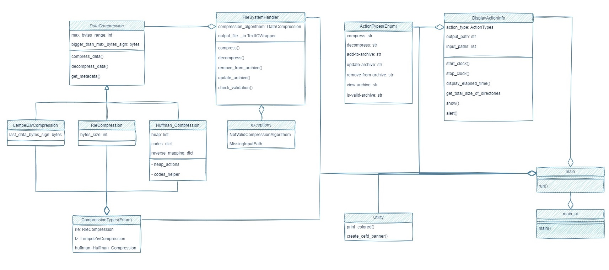

## My Final Project In INTRO Course

## Installation

Install using pip:

`pip3 install compressfly`

## Usage

`python main.py [--input_paths_list DIRECTORIES] [--output_path DIRECTORY] [--compression_type CompressionTypes] [--action_type ActionTypes] [--byte_size INT] [--ignore_files LIST] [--ignore_folders LIST] [--ignore_extensions LIST]`

| Argument                            | Description                                             |
|-------------------------------------|---------------------------------------------------------| 
| --input_paths_list                  | input directories list [REQUIRED]                       | 
| --output_path                       | output directory path  [REQUIRED for compression Default='']                                 |
| --compression_type                  | compression algorithem [Default=rle]                              |
| --action_type                       | action to execute                                       |
| --byte_size                         | byte size (Relevant just for rle compression) [Default=2]           |
| --ignore_files                      | option to ignore specific files while compression       |
| --ignore_folders                    | option to ignore specific folders while compression     |
| --ignore_extensions                 | option to ignore specific extensions while compression  |
| -h, --help                          | Show help                                               |

## Examples

**Compress assets folder into archive file called output.bin:**

`python main.py --input_paths_list assets --output_path output.bin --action_type compress`

**Compress with huffman algorithem:**

`python main.py --input_paths_list assets --output_path output.bin --action_type compress --compression_type huffman`

**Compress and ignore all files with 'png'/'txt' extension:**

`python main.py --input_paths_list assets --output_path output.bin --action_type compress --ignore_extensions png txt`

**Decompress archive file - output.bin:**

`python main.py --input_paths_list output.bin --action_type decompress`

**View files inside archive file - output.bin:**

`python main.py --input_paths_list output.bin --action_type view-archive`

**Add files into archive file - output.bin:**

`python main.py --input_paths_list path/to/new/file --output_path output.bin --action_type add-to-archive`

**Remove files from archive file - output.bin:**

`python main.py --input_paths_list path/to/file/pre/delete --output_path output.bin --action_type remove-from-archive`

**Update files from archive file - output.bin:**

`python main.py --input_paths_list path/to/file/pre/upadte1 path/to/file/pre/upadte2 --output_path output.bin --action_type update-archive`

## UI 

**Setup CompressFly UI:**

`python main_ui.py`

## DOCUMENTION

**Setup Documention with mkdocs:**

1) `python -m mkdocs build`
2) `python -m mkdocs serve`

## Tests

**Test this project just by running:**

`python -m pytest`

## ARCHITECTURE

<!--  -->